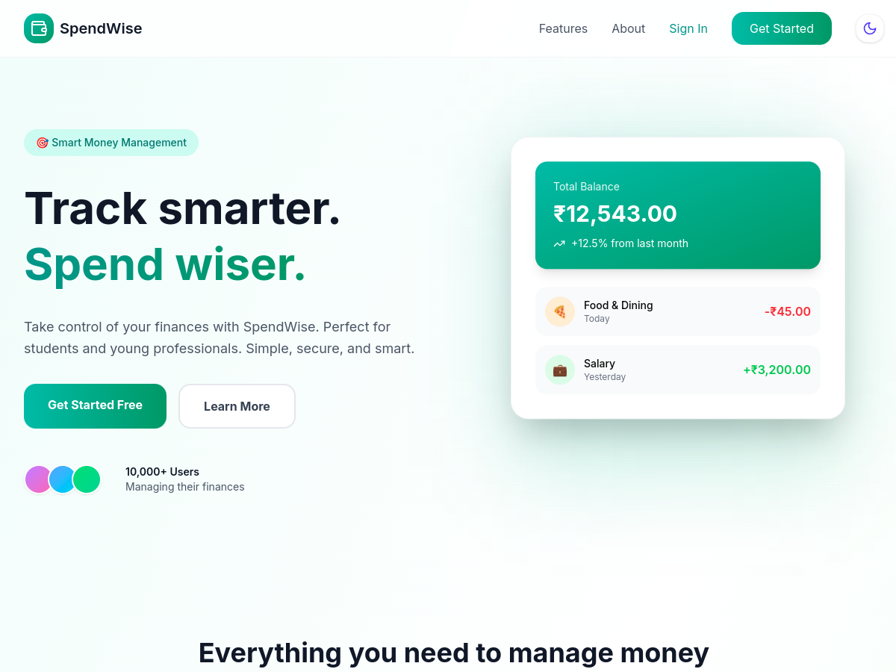
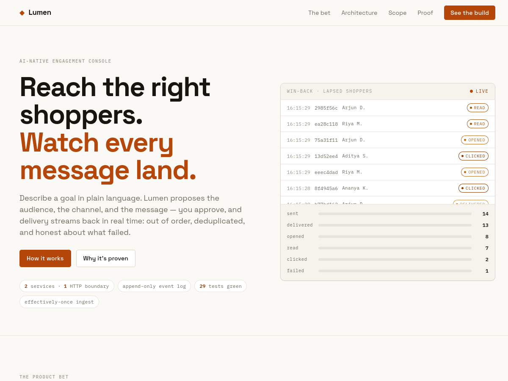
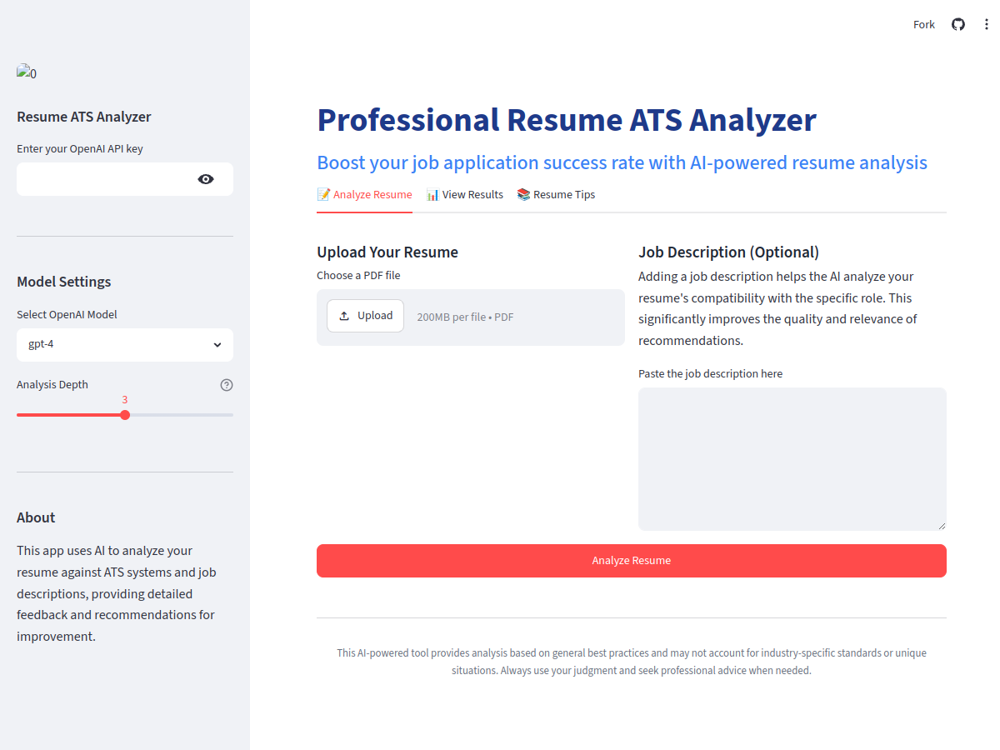

<div align="center">


# Pronov Mazumdar — 3D Interactive Portfolio

<a href="https://pronov06.github.io/">
  
</a>

<p>
  <a href="https://pronov06.github.io/"></a>
  <a href="https://linkedin.com/in/pronov"></a>
  <a href="https://github.com/pronov06"></a>
  <a href="https://x.com/pranavv9_"></a>
  <a href="mailto:mazumdarpronov@gmail.com"></a>
</p>

<br/>


<sub>An immersive, real-time 3D portfolio — rigged character, physics, post-processing and buttery GSAP scroll choreography.</sub>

<br/><br/>


</div>

---

## 🧭 Contents

- [✨ Highlights](#-highlights)
- [🛠️ Built With](#️-built-with)
- [💼 Featured Projects](#-featured-projects)
- [🚀 Run Locally](#-run-locally)
- [📁 Project Structure](#-project-structure)
- [🌐 Deployment](#-deployment)
- [📫 Connect](#-connect)
- [🙏 Acknowledgements](#-acknowledgements)
- [📜 License](#-license)

---

## ✨ Highlights

> A single-page, scroll-driven experience that pairs a real-time 3D scene with my work as an AI/ML and full-stack engineer.

- 🧍 **Real-time 3D character** — rigged GLTF model with mouse-tracked head, blink, typing and intro animations, rendered with Three.js + React Three Fiber.
- 🌌 **Physics & post-processing** — floating tech-stack spheres (Rapier physics) with N8AO ambient occlusion and HDR environment lighting.
- 🎞️ **GSAP scroll choreography** — section transitions, a pinned horizontal **Work** carousel, an animated career timeline, and smooth scrolling via ScrollSmoother.
- 🖱️ **Custom cursor & micro-interactions** — hover states, magnetic social icons, and a load-in sequence.
- 📱 **Responsive** — desktop gets the full 3D treatment; mobile gets a tuned, lightweight fallback.
- ⚡ **Performance-minded** — capped device-pixel-ratio, off-screen render pausing, and visibility-gated canvases.

---

## 🛠️ Built With

| Layer | Tech |
|---|---|
| **Framework** | React 18 · TypeScript · Vite |
| **3D / WebGL** | Three.js · @react-three/fiber · @react-three/drei · three-stdlib |
| **Physics & FX** | @react-three/rapier · @react-three/postprocessing (N8AO) |
| **Animation** | GSAP · @gsap/react · ScrollTrigger · ScrollSmoother |
| **UI bits** | react-fast-marquee · react-icons |
| **Type** | Clash Display (display) · Geist (body) |
| **Analytics** | @vercel/analytics |
| **Deploy** | GitHub Pages · GitHub Actions |

---

## 💼 Featured Projects

<table>
<tr>
<td width="33%" valign="top" align="center">
<a href="https://spend-wise-gmrs.vercel.app/"></a>
<br/><br/>
<b>SpendWise</b><br/>
<sub>Full-stack personal finance tracker — expenses, budgets, group splits & AI insights.</sub>
<br/><br/>
<code>React</code> <code>Node</code> <code>Express</code> <code>MongoDB</code> <code>JWT</code>
<br/><br/>
<a href="https://spend-wise-gmrs.vercel.app/">Live ↗</a>
</td>
<td width="33%" valign="top" align="center">
<a href="https://huggingface.co/spaces/pronov06/lumen-crm"></a>
<br/><br/>
<b>Lumen</b><br/>
<sub>A mini CRM engagement loop — pick an audience, send a campaign, learn from responses.</sub>
<br/><br/>
<code>FastAPI</code> <code>SQLAlchemy</code> <code>React</code> <code>TypeScript</code>
<br/><br/>
<a href="https://huggingface.co/spaces/pronov06/lumen-crm">Live ↗</a>
</td>
<td width="33%" valign="top" align="center">
<a href="https://analyzemyresume.streamlit.app/"></a>
<br/><br/>
<b>Resume ATS Analyzer</b><br/>
<sub>AI-powered ATS scoring with keyword analysis, strengths & improvement tips.</sub>
<br/><br/>
<code>Python</code> <code>spaCy</code> <code>NLTK</code> <code>Streamlit</code>
<br/><br/>
<a href="https://analyzemyresume.streamlit.app/">Live ↗</a>
</td>
</tr>
</table>

---

## 🚀 Run Locally

```bash
# 1. Clone
git clone https://github.com/pronov06/pronov06.github.io.git
cd pronov06.github.io

# 2. Install
npm install

# 3. Start the dev server (Vite)
npm run dev

# 4. Production build
npm run build
npm run preview   # preview the build locally
```

> Requires **Node 18+**. The dev server runs at `http://localhost:5173`.

---

## 📁 Project Structure

```text
src/
├─ components/
│  ├─ Character/        # 3D scene, model loading, rig animations (do not edit lightly)
│  ├─ Landing.tsx       # hero — name, role, social icons
│  ├─ About.tsx         # bio
│  ├─ WhatIDo.tsx       # services / skill cards
│  ├─ Career.tsx        # experience timeline
│  ├─ Work.tsx          # pinned horizontal project carousel
│  ├─ Contact.tsx       # footer / contact
│  ├─ TechStack.tsx     # physics sphere canvas
│  └─ utils/            # GSAP scroll + split-text helpers
├─ data/                # bone data for the rig
├─ App.tsx · index.css  # shell + global styles / tokens
public/
├─ models/              # 3D model + HDR environment
├─ images/              # project shots, tech icons, avatars
└─ font/                # Clash Display
```

---

## 🌐 Deployment

Hosted on **GitHub Pages** and deployed automatically by **GitHub Actions** on every push to `main`.

```bash
git push origin main   # → Actions builds & publishes → https://pronov06.github.io/
```

---

## 📫 Connect

<p>
  <a href="https://pronov06.github.io/"></a>
  <a href="https://linkedin.com/in/pronov"></a>
  <a href="https://github.com/pronov06"></a>
  <a href="https://x.com/pranavv9_"></a>
  <a href="mailto:mazumdarpronov@gmail.com"></a>
</p>

**Pronov Mazumdar** · AI/ML Engineer & Full-Stack Developer · Chennai, India
Final-year B.Tech CSE (Big Data Analytics) @ SRM Institute of Science and Technology

---

## 🙏 Acknowledgements

- 3D portfolio template originally created by **[Moncy Yohannan](https://github.com/MoncyDev/Portfolio-Website)** — adapted here with my own content, projects, copy, and tuning. All original 3D avatar assets belong to the original author and are **not** redistributed; my live site uses my own content.
- [GSAP](https://gsap.com/) · [Three.js](https://threejs.org/) · [React Three Fiber](https://docs.pmnd.rs/react-three-fiber) · [Rapier](https://rapier.rs/)

---

## 📜 License

This project is based on a template released under the **Personal Portfolio License (PPL) v1.0** — see [`LICENSE`](LICENSE). Please respect the original author's terms: don't clone the full design/experience or reuse the proprietary 3D assets. Build your own. 🙂

<div align="center"><sub>⭐ If this inspired your own build, a star is always appreciated.</sub></div>
